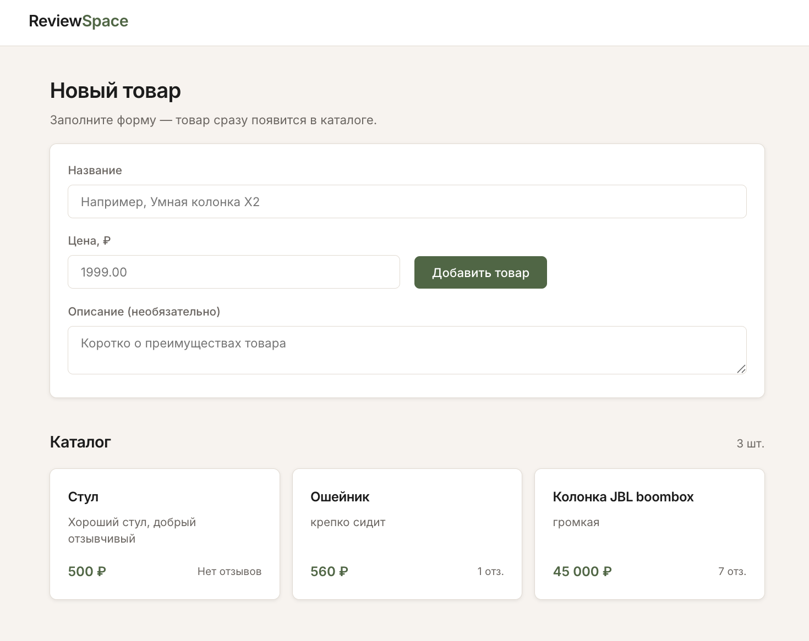
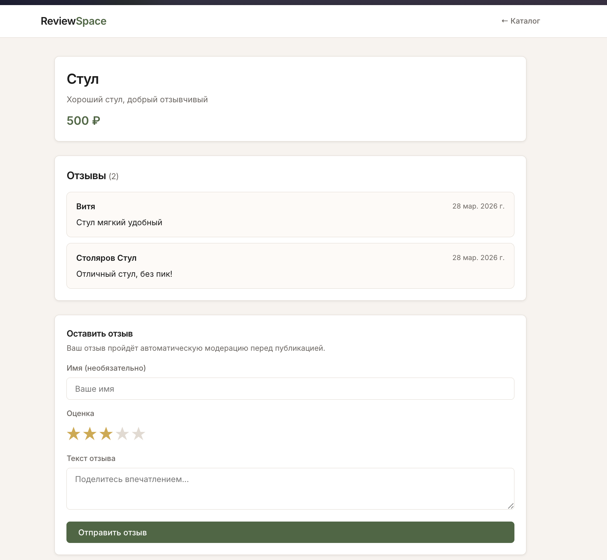
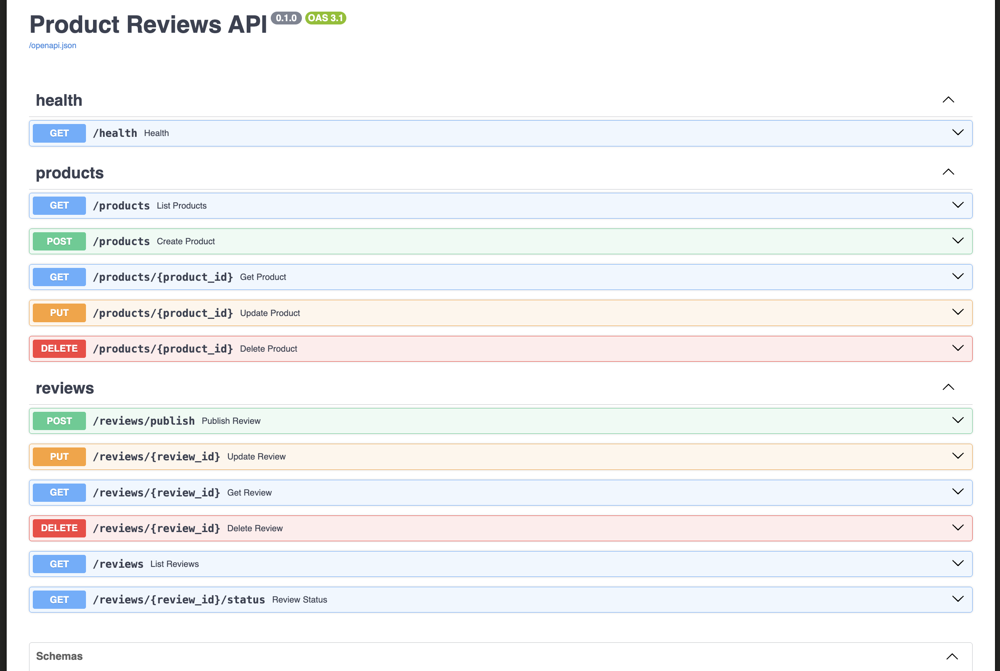
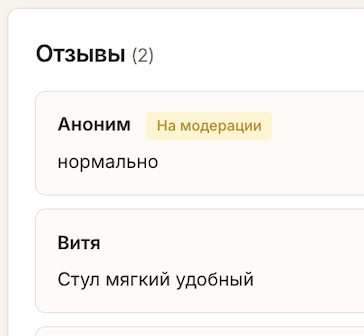

# Review Service

Веб-сервис для публикации и автоматической модерации пользовательских отзывов на товары. Основная идея в том, что отзывы перед публикацией проходят через ML-модели, которые проверяют текст на токсичность и спам. Если текст проходит проверку — отзыв публикуется, если нет — отклоняется, и пользователю показывается причина.

Проект построен на микросервисной архитектуре: API-сервер на FastAPI принимает запросы, RabbitMQ используется как очередь задач для асинхронной обработки, PostgreSQL хранит все данные, а отдельный воркер занимается непосредственно ML-модерацией.



## Описание компонентов

### API (FastAPI)

Основной бэкенд-сервис, который предоставляет REST API для работы с товарами и отзывами. Реализован на FastAPI с использованием SQLAlchemy в качестве ORM и Pydantic для валидации данных.

Когда пользователь отправляет новый отзыв через эндпоинт `/reviews/publish`, API сохраняет его в базу данных со статусом `pending` и отправляет ID этого отзыва в очередь RabbitMQ. После этого сразу возвращает ответ клиенту, не дожидаясь результатов модерации — таким образом пользователь не ждёт, пока модель обработает текст.

### Worker (ML-модерация)

Отдельный процесс, который подключается к RabbitMQ и слушает очередь на новые задачи. Когда приходит сообщение с ID отзыва, воркер достаёт текст из базы и последовательно прогоняет его через две модели:

- **Токсичность** — модель [`s-nlp/russian_toxicity_classifier`](https://huggingface.co/s-nlp/russian_toxicity_classifier), обученная на русскоязычных текстах. Порог срабатывания установлен на `0.4` — это чуть строже стандартного 0.5, чтобы отсекать пограничные случаи.
- **Спам** — модель [`RUSpam/spam_deberta_v4`](https://huggingface.co/RUSpam/spam_deberta_v4) на основе архитектуры DeBERTa. Порог стандартный — `0.5`.

По результатам проверки воркер обновляет статус отзыва в базе данных: либо `published` (прошёл модерацию), либо `rejected` (отклонён с указанием причины и score модели).

### Frontend

Простой фронтенд на HTML, CSS и JavaScript без каких-либо фреймворков. Состоит из двух страниц: каталог товаров и страница конкретного товара с его отзывами. После отправки отзыва фронтенд периодически опрашивает эндпоинт `/reviews/{id}/status`, чтобы отобразить результат модерации.



## Используемые технологии

- **Python 3.11** — основной язык для бэкенда и воркера
- **FastAPI** — веб-фреймворк для API, автоматическая генерация Swagger-документации
- **SQLAlchemy 2.0** — ORM для работы с базой данных
- **Pydantic** — валидация входных и выходных данных
- **PostgreSQL 16** — основная база данных
- **RabbitMQ 3** — брокер сообщений для асинхронной обработки задач
- **HuggingFace Transformers + PyTorch** — инференс ML-моделей
- **Docker Compose** — оркестрация всех сервисов

## Запуск проекта

Для запуска нужен установленный Docker и Docker Compose.

Клонировать репозиторий:

```bash
git clone https://github.com/Alimhux/review-nlp-service
cd Review-Service
```

Создать файл `.env` в корне проекта со следующим содержимым:

```env
POSTGRES_USER=postgres
POSTGRES_PASSWORD=postgres
POSTGRES_DB=reviews
DB_USER=postgres
DB_PASSWORD=postgres
DB_NAME=reviews
DB_HOST=db
DB_PORT=5432
RABBIT_HOST=rabbitmq
RABBIT_PORT=5672
RABBIT_USER=guest
RABBIT_PASSWORD=guest
RABBIT_QUEUE=reviews
```

Собрать и запустить все сервисы:

```bash
docker compose up --build
```

При первом запуске воркер скачивает ML-модели с HuggingFace (~1.5 ГБ), поэтому это может занять некоторое время. При последующих запусках модели берутся из кеша и сервис стартует значительно быстрее.

После успешного запуска будут доступны:

- **Фронтенд** — http://localhost:8080
- **Swagger UI** (документация API) — http://localhost:8000/docs
- **RabbitMQ Management** — http://localhost:15672 (логин: guest, пароль: guest)



## Эндпоинты API

Подробная интерактивная документация доступна через Swagger UI по адресу `/docs`. Ниже перечислены основные эндпоинты.

### Товары

| Метод | Эндпоинт | Описание |
|-------|----------|----------|
| `GET` | `/products` | Получить список всех товаров |
| `POST` | `/products` | Создать новый товар |
| `GET` | `/products/{id}` | Получить товар вместе с его отзывами |
| `PUT` | `/products/{id}` | Обновить информацию о товаре |
| `DELETE` | `/products/{id}` | Удалить товар (отзывы удаляются каскадно) |

### Отзывы

| Метод | Эндпоинт | Описание |
|-------|----------|----------|
| `POST` | `/reviews/publish` | Отправить отзыв на модерацию |
| `GET` | `/reviews` | Получить список отзывов (можно фильтровать по `product_id`) |
| `GET` | `/reviews/{id}` | Получить конкретный отзыв |
| `GET` | `/reviews/{id}/status` | Проверить текущий статус модерации |
| `PUT` | `/reviews/{id}` | Обновить текст отзыва (отправляется на повторную модерацию) |
| `DELETE` | `/reviews/{id}` | Удалить отзыв |

## Процесс модерации

Ниже показана последовательность взаимодействия компонентов при отправке нового отзыва:

```
Пользователь         API              RabbitMQ         Worker            БД
     │                │                  │               │               │
     │── POST отзыв ─→│                  │               │               │
     │                │── save(pending) ─────────────────────────────────→│
     │                │── publish id ───→│               │               │
     │←── 201 ────────│                  │               │               │
     │                │                  │── consume ───→│               │
     │                │                  │               │── get text ──→│
     │                │                  │               │←── text ──────│
     │                │                  │               │               │
     │                │                  │               │  [ML models]  │
     │                │                  │               │               │
     │                │                  │               │── update ────→│
     │── GET status ─→│                  │               │               │
     │                │── query ────────────────────────────────────────→│
     │←── published ──│                  │               │               │
```

Сначала API сохраняет отзыв в базу со статусом `pending` и кладёт его ID в очередь. Воркер забирает задачу, достаёт текст, прогоняет через модели токсичности и спама, и записывает результат обратно в базу. Фронтенд в это время периодически проверяет статус и отображает результат, когда модерация завершена.



## Структура проекта

```
Review-Service/
├── docker-compose.yaml          # конфигурация всех сервисов
├── .env                         # переменные окружения (не в git)
│
├── api/                         # API-сервис (FastAPI)
│   ├── Dockerfile
│   ├── requirements.txt
│   ├── main.py                  # точка входа, настройка CORS, подключение роутеров
│   ├── deps.py                  # dependency injection для сессии БД
│   ├── queue.py                 # отправка задач в RabbitMQ
│   └── routers/
│       ├── health.py            # эндпоинт проверки здоровья сервиса
│       ├── products.py          # CRUD-эндпоинты для товаров
│       └── reviews.py           # эндпоинты для работы с отзывами
│
├── worker/                      # ML-воркер
│   ├── Dockerfile
│   ├── requirements.txt
│   ├── main.py                  # подключение к RabbitMQ, цикл обработки сообщений
│   └── moderation.py            # ML-пайплайны для токсичности и спама
│
├── common/                      # общий код, используемый и API, и воркером
│   ├── config.py                # чтение настроек из переменных окружения
│   ├── db.py                    # настройка SQLAlchemy engine и сессий
│   ├── models.py                # ORM-модели Product и Review
│   ├── schemas.py               # Pydantic-схемы для валидации
│   └── crud.py                  # функции для работы с базой данных
│
└── frontend/                    # статический фронтенд
    ├── Dockerfile
    ├── index.html               # страница каталога товаров
    └── product.html             # страница товара с отзывами
```

## Полезные команды

```bash
docker compose up --build          # собрать образы и запустить все сервисы
docker compose down                # остановить все сервисы
docker compose down -v             # остановить и удалить volumes (сбросить БД)
docker compose logs -f worker      # смотреть логи воркера в реальном времени
docker compose logs -f api         # смотреть логи API
```
